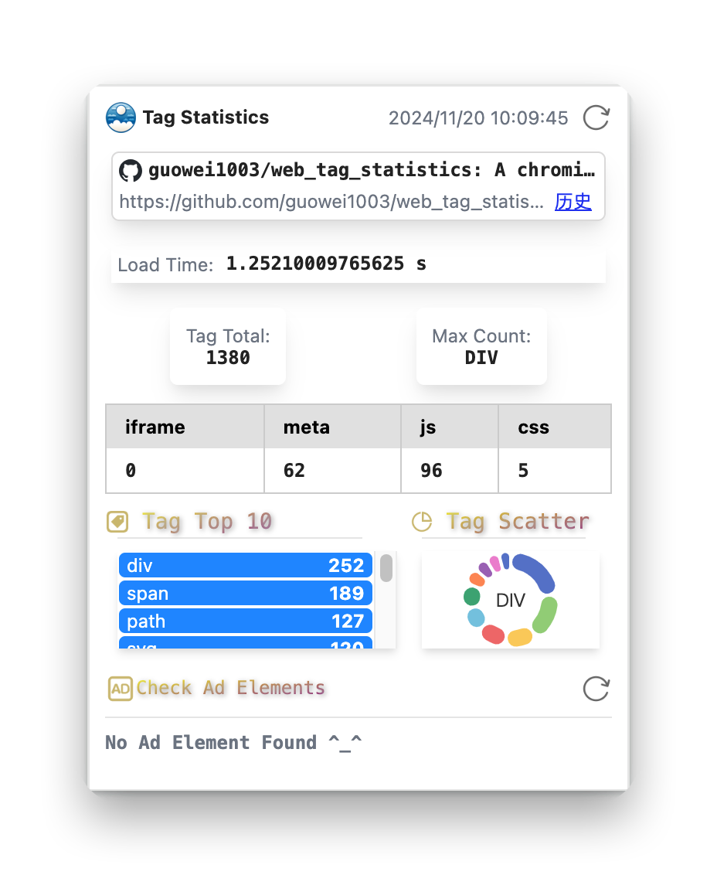
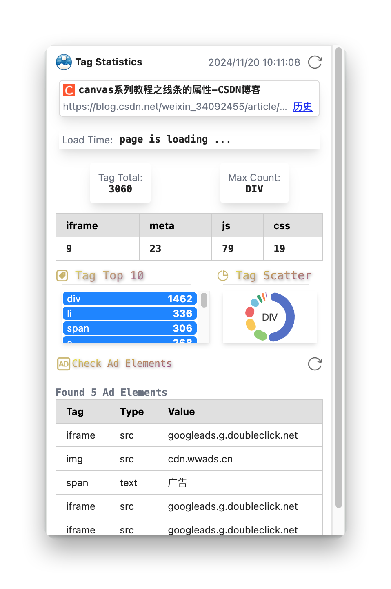

#  Simple Page Statistics

Extension to display simple page statistics on the Chrome/Edge/Brave web browser.

## Features

- Display the number of tags on the current page
- Display whether there are advertisements present
- Display the loading time of the page
- ...

## Showcase


## Usage

```
npm install
npm run build
```

Then, load the `dist` folder as an unpacked extension in Chrome/Edge/Brave.


## License

[MIT]([https://github.com/chinese-poetry/chinese-poetry/blob/master/LICENSE](https://github.com/guowei1003/web_tag_statistics/blob/main/LICENSE)) License
