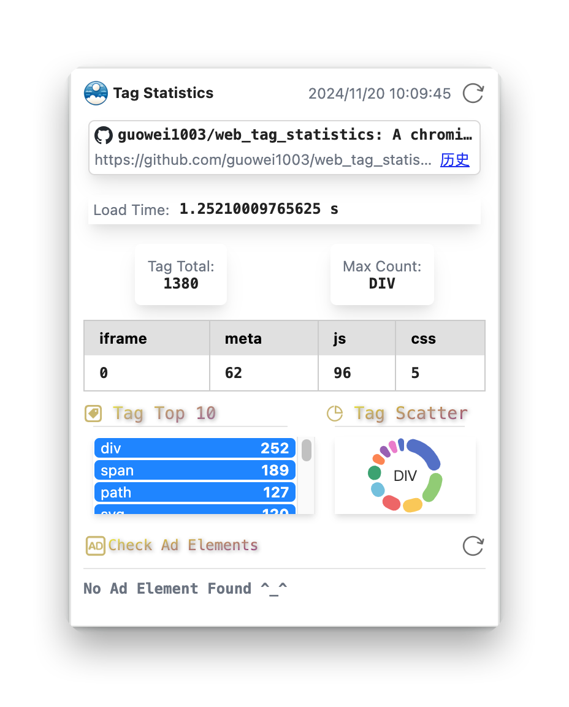
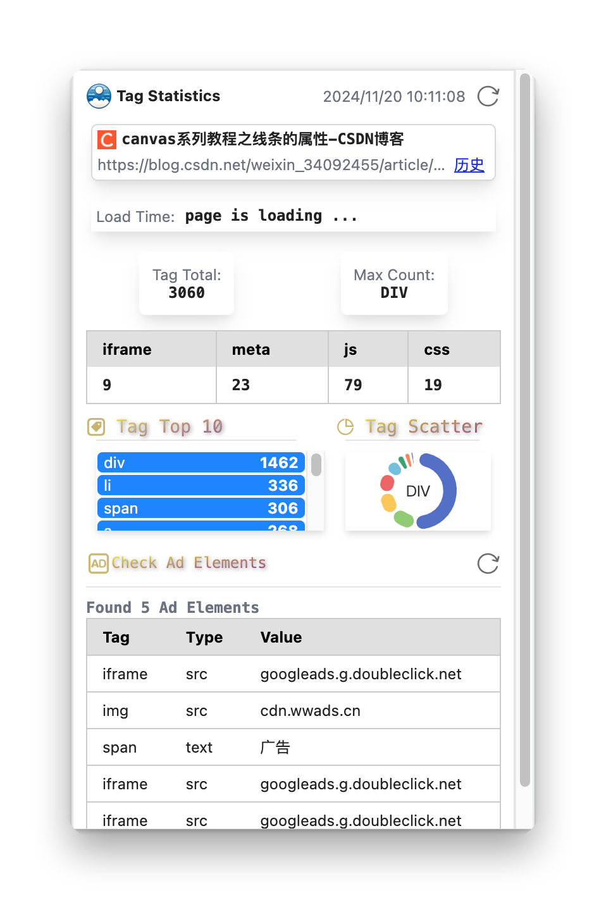

#  Simple Page Statistics

扩展程序，用于在Chrome/Edge/BBrave网络浏览器上显示简单的页面统计信息。

## 功能

- 显示当前页面的标签数量
- 显示是否存在广告
- 显示页面的加载时间
- ...

## 截图


## 使用方法

```
npm install
npm run build
```

然后，在Chrome/Edge/BBrave中将“dist”文件夹作为解压缩的扩展程序加载。

## License

[MIT]([https://github.com/chinese-poetry/chinese-poetry/blob/master/LICENSE](https://github.com/guowei1003/web_tag_statistics/blob/main/LICENSE)) 许可证。

